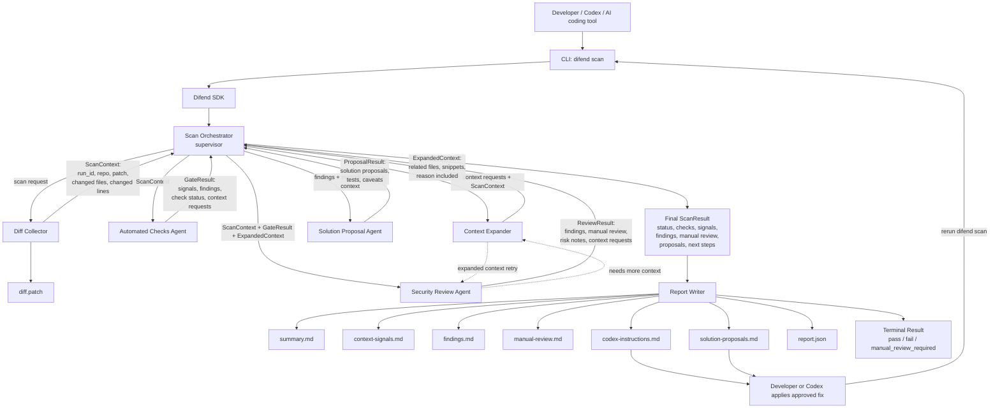
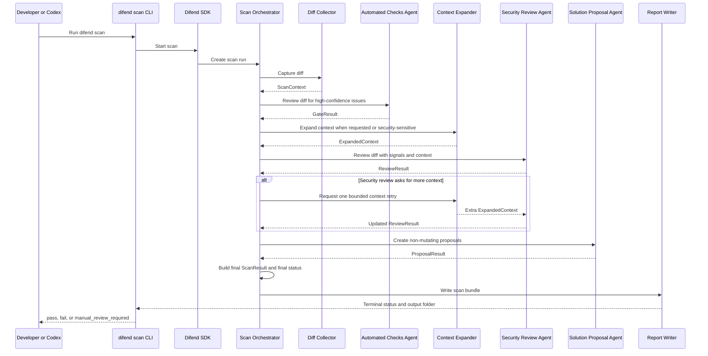
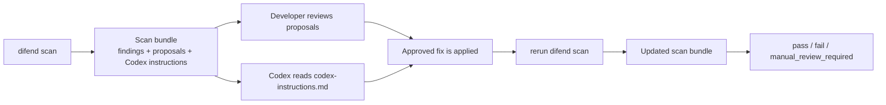

# Difend

Do not trust AI-generated code blindly. Review every AI-produced diff with `difend` before shipping.

Difend means **Diff Defend**: a diff-aware, supervisor-worker multi-agent security review SDK with a CLI entry point. It reviews code changes produced by developers, Codex, or other AI coding tools, then writes a persistent scan bundle that humans and AI agents can use for safe follow-up.

## Idea

AI-assisted coding makes it easy to produce large changes quickly, but security review often becomes the bottleneck. A single diff can include hidden risks that are easy to miss during normal code review, especially when reviewers are also checking functionality, style, and correctness.

Existing automated security tools are useful for common issues like leaked secrets, vulnerable dependencies, injection patterns, unsafe shell execution, and weak cryptography. They are weaker at deeper security questions involving authentication, authorisation, privilege boundaries, business logic, session handling, and sensitive data flows.

Difend reviews the code diff first, expands context only when needed, and produces structured security context that can be read by developers, security reviewers, Codex, or another AI coding assistant.

The goal is not only to produce a report. The goal is to create a reusable handoff bundle that explains what changed, what was scanned, what was found, what still needs judgement, what fix is proposed, and what the safest next action should be.

## Product Shape

Difend has three connected layers:

- **CLI:** `difend scan` gives immediate terminal feedback after a code change.
- **SDK:** the reusable scan engine captures diffs, runs the supervisor-worker agent pipeline, creates findings, and writes scan bundles.
- **Context bundle:** generated `.md`, `.patch`, and `.json` files preserve what was scanned, what was found, what needs manual review, proposed fixes, and what Codex or another agent should inspect next.

This means Difend supports two workflows at the same time:

- quick local security feedback for developers
- deeper AI-assisted security review through a structured handoff bundle

## Core Principle

Difend should be:

- **Diff-first:** review changed lines before looking at the whole repository.
- **Evidence-driven:** every finding should point to a file, line, check, and reason.
- **SDK-centered:** the CLI should stay thin while the SDK owns capture, orchestration, review, and reporting.
- **Supervisor-worker:** one orchestrator controls focused worker agents instead of letting agents freely chat.
- **Context-aware:** expand into nearby files only when a worker asks for it or the diff touches security-sensitive code.
- **Human-safe:** uncertain security risks should become manual-review items instead of guessed-away verdicts.
- **Non-mutating by default:** Difend may propose fixes, but it should not change application source code without explicit developer approval.
- **Auditable:** every scan should save the exact patch and structured report used to make the decision.

## Hackathon Architecture

For the 2-day hackathon, Difend should use a lightweight supervisor-worker multi-agent system inside the SDK.

The system has one supervisor and a small set of focused workers:

- **Scan Orchestrator:** the supervisor. It owns the scan, runs workers in order, passes data between them, decides the final status, and builds the final `ScanResult`.
- **Diff Collector:** captures the Git diff and changed-file metadata.
- **Context Expander:** reads nearby files only when context is requested or the diff is security-sensitive.
- **Automated Checks Agent:** catches obvious high-confidence security issues and emits context requests when it needs nearby code.
- **Security Review Agent:** reviews subtle or context-dependent risks, especially auth, permissions, sessions, data access, payments, and business logic.
- **Solution Proposal Agent:** creates non-mutating fix proposals, suggested tests, and caveats for each finding or manual-review item.
- **Report Writer:** writes Markdown, JSON, the scanned patch, and terminal output from the final `ScanResult`.

The Report Writer is a worker in the pipeline, but it is not a judging agent. It formats the final data.



## Data Flow Between Workers

Agents do not write report files directly. They return structured outputs to the Scan Orchestrator. The Scan Orchestrator combines those outputs into one `ScanResult`. The Report Writer serializes that final result into Markdown and JSON.

| Step | Sender | Receiver | Payload |
|---|---|---|---|
| 1 | CLI | SDK | repository path and scan options |
| 2 | Scan Orchestrator | Diff Collector | scan request |
| 3 | Diff Collector | Scan Orchestrator | `ScanContext` with run id, patch, changed files, changed lines, and diff stats |
| 4 | Scan Orchestrator | Automated Checks Agent | `ScanContext` |
| 5 | Automated Checks Agent | Scan Orchestrator | `GateResult` with context signals, high-confidence findings, check status, and context requests |
| 6 | Scan Orchestrator | Context Expander | context requests plus current scan context |
| 7 | Context Expander | Scan Orchestrator | `ExpandedContext` with related files, snippets, and reasons |
| 8 | Scan Orchestrator | Security Review Agent | `ScanContext`, `GateResult`, and `ExpandedContext` |
| 9 | Security Review Agent | Scan Orchestrator | `ReviewResult` with findings, manual-review items, risk notes, and optional context requests |
| 10 | Scan Orchestrator | Context Expander | second-pass context request, if needed |
| 11 | Context Expander | Security Review Agent | bounded extra context for one retry |
| 12 | Scan Orchestrator | Solution Proposal Agent | findings, manual-review items, and relevant context |
| 13 | Solution Proposal Agent | Scan Orchestrator | `ProposalResult` with recommended changes, tests, caveats, and Codex prompt context |
| 14 | Scan Orchestrator | Report Writer | final `ScanResult` |
| 15 | Report Writer | Filesystem and terminal | scan bundle files and final terminal status |

## Context Expansion

Difend starts diff-only, then expands context only when needed.

Context expansion is triggered when:

- the changed file looks security-sensitive, such as route, auth, session, payment, database, file upload, or config code
- the Automated Checks Agent emits a `context_requests` item
- the Security Review Agent cannot decide whether a change is safe from the diff alone

The Context Expander should inspect nearby code conservatively:

- imports used by changed lines
- route registration and middleware
- auth, role, permission, and session helpers
- models and schemas touched by the diff
- tests related to the changed files
- package or config files changed by the diff

For the hackathon version, context expansion should be bounded:

- maximum one extra context retry after the Security Review Agent asks for more
- maximum number of related files per scan
- maximum bytes or lines per related file
- every included file must have a reason

Example context request:

```json
{
  "request_id": "ctx-001",
  "requested_by": "security-review",
  "reason": "Admin route changed without visible authorization middleware.",
  "files_or_patterns": [
    "src/routes/admin.ts",
    "src/middleware/auth.ts",
    "src/**/permissions*"
  ]
}
```

Example expanded context:

```json
{
  "request_id": "ctx-001",
  "included_files": [
    {
      "file": "src/middleware/auth.ts",
      "reason": "Imported by changed admin route and may enforce authorization.",
      "snippet": "export function requireRole(role) { ... }"
    }
  ]
}
```

## Worker Responsibilities

- **Scan Orchestrator:** coordinates the full scan, stores intermediate results in memory, performs simple final status logic, and builds `ScanResult`.
- **Diff Collector:** runs `git diff` and `git diff --cached`, writes `diff.patch`, and returns changed-file metadata.
- **Automated Checks Agent:** checks for secrets, injection patterns, unsafe shell execution, weak crypto, insecure sessions, sensitive logging, and risky dependency changes.
- **Security Review Agent:** reviews subtle security-sensitive changes and creates manual-review items when risk depends on wider application context.
- **Context Expander:** reads nearby files requested by agents and returns only relevant snippets with reasons.
- **Solution Proposal Agent:** proposes fixes and tests without editing source code.
- **Report Writer:** writes the final scan bundle from `ScanResult`.

## Runtime Sequence



## Final Status Logic

The Scan Orchestrator chooses the final status with simple hackathon-friendly rules:

```text
if any high-confidence finding exists:
  status = fail
else if any manual-review item exists:
  status = manual_review_required
else if any unresolved context request exists:
  status = manual_review_required
else:
  status = pass
```

The CLI may display `manual_review_required` as `manual review required` for readability. The machine-readable status should always be one of:

- `pass`
- `fail`
- `manual_review_required`

## Feedback Loop

Difend should support a safe review-and-rescan loop.



The loop should remain non-mutating by default:

1. Difend scans the diff.
2. Difend proposes fixes in `solution-proposals.md`.
3. A developer decides whether Codex or a human should apply the fix.
4. The developer reruns `difend scan`.
5. Difend writes a new scan bundle.
6. Later versions can compare the new result with the previous run.

## Terminal Experience

The terminal output should be short, readable, and useful during normal development.

```text
Difend scan started

Capturing diff... done
Running automated checks... warning
Expanding related context... done
Running security review... manual review required
Creating solution proposals... done
Writing scan bundle... done

Status: manual review required
Report written to: .difend/runs/2026-04-29-001/
Next: ask Codex to read .difend/runs/2026-04-29-001/codex-instructions.md
```

## Scan Bundle

Each scan should always generate an output folder, even when no problems are found.

```text
.difend/
  runs/
    2026-04-29-001/
      summary.md
      context-signals.md
      findings.md
      manual-review.md
      solution-proposals.md
      codex-instructions.md
      diff.patch
      report.json
```

### File Responsibilities

- `summary.md`: human-readable scan summary, final status, checks performed, and next steps.
- `context-signals.md`: deterministic security signals and context expansion notes.
- `findings.md`: confirmed findings with severity, evidence, location, agent name, and recommendation.
- `manual-review.md`: suspicious areas that require human or AI-assisted security judgement.
- `solution-proposals.md`: non-mutating proposed fixes, implementation notes, suggested tests, and caveats.
- `codex-instructions.md`: focused handoff instructions telling Codex what was scanned, what needs deeper review, which files to inspect, and how to continue safely.
- `diff.patch`: the exact Git diff that Difend scanned.
- `report.json`: structured machine-readable report for future integrations, CI, IDE plugins, dashboards, and AI coding tools.

## Structured Output

Workers should return structured data so the SDK can write both Markdown and JSON reports.

### ScanContext

```json
{
  "run_id": "2026-04-29-001",
  "repository_path": "/path/to/repo",
  "patch_file": "diff.patch",
  "changed_files": [
    {
      "file": "src/routes/admin.ts",
      "added_lines": [42, 43],
      "deleted_lines": [41],
      "file_type": "typescript"
    }
  ]
}
```

### GateResult

```json
{
  "agent": "automated-checks",
  "status": "warning",
  "signals": [
    {
      "signal_id": "signal-001",
      "type": "removed_auth_logic",
      "severity_hint": "high",
      "file": "src/routes/admin.ts",
      "line": 42,
      "evidence": "Security-sensitive auth, role, permission, or session logic was removed."
    }
  ],
  "findings": [],
  "context_requests": [
    {
      "request_id": "ctx-001",
      "reason": "Check whether authorization moved to middleware.",
      "files_or_patterns": ["src/middleware/auth.ts"]
    }
  ]
}
```

### ReviewResult

```json
{
  "agent": "security-review",
  "status": "manual_review_required",
  "findings": [],
  "manual_review": [
    {
      "review_id": "manual-001",
      "type": "authorization_change",
      "severity": "high",
      "file": "src/routes/admin.ts",
      "line": 42,
      "reason": "Admin route changed and no authorization check is visible in the diff.",
      "related_files": ["src/middleware/auth.ts"]
    }
  ],
  "context_requests": []
}
```

### ProposalResult

```json
{
  "agent": "solution-proposal",
  "solution_proposals": [
    {
      "proposal_id": "solution-001",
      "source_items": ["manual-001"],
      "title": "Verify or restore admin role enforcement",
      "status": "proposed",
      "files_to_review": [
        "src/routes/admin.ts",
        "src/middleware/auth.ts"
      ],
      "recommended_change": "Require an explicit admin role check before the route handler runs, unless global middleware already enforces it.",
      "tests_to_add": [
        "Non-admin users receive 403 for the admin route.",
        "Admin users can still access the admin route."
      ],
      "caveats": [
        "Inspect route-level and global middleware before applying a code change."
      ]
    }
  ]
}
```

## Report JSON Shape

The first version of `report.json` should be the final `ScanResult` serialized to JSON.

```json
{
  "tool": "difend",
  "run_id": "2026-04-29-001",
  "status": "manual_review_required",
  "repository": {
    "path": "/path/to/repo",
    "base_ref": null,
    "head_ref": null
  },
  "diff": {
    "files_changed": 1,
    "added_lines": 2,
    "deleted_lines": 1,
    "patch_file": "diff.patch"
  },
  "checks": [
    {
      "agent": "automated-checks",
      "status": "warning",
      "signals_count": 1,
      "findings_count": 0
    },
    {
      "agent": "security-review",
      "status": "manual_review_required",
      "manual_review_count": 1
    },
    {
      "agent": "solution-proposal",
      "status": "done",
      "proposal_count": 1
    }
  ],
  "context_signals": [
    {
      "signal_id": "signal-001",
      "source": "automated-checks",
      "type": "removed_auth_logic",
      "severity_hint": "high",
      "file": "src/routes/admin.ts",
      "line": 42
    }
  ],
  "expanded_context": [
    {
      "file": "src/middleware/auth.ts",
      "reason": "Requested to verify whether admin authorization moved to middleware."
    }
  ],
  "findings": [],
  "manual_review": [
    {
      "review_id": "manual-001",
      "type": "authorization_change",
      "severity": "high",
      "file": "src/routes/admin.ts",
      "line": 42,
      "reason": "Admin route changed and no authorization check is visible in the diff."
    }
  ],
  "solution_proposals": [
    {
      "proposal_id": "solution-001",
      "source_items": ["manual-001"],
      "title": "Verify or restore admin role enforcement",
      "status": "proposed",
      "files_to_review": [
        "src/routes/admin.ts",
        "src/middleware/auth.ts"
      ],
      "recommended_change": "Require an explicit admin role check before the route handler runs, unless global middleware already enforces it."
    }
  ],
  "codex_next_steps": [
    "Read solution-proposals.md before editing.",
    "Inspect src/routes/admin.ts and src/middleware/auth.ts.",
    "Verify whether admin authorization is enforced before applying a fix.",
    "After any approved fix, rerun difend scan."
  ]
}
```

## Context Handoff Contract

Every scan should leave enough context for a future reviewer or AI coding assistant to answer these questions without starting from scratch:

- What diff was scanned?
- Which files and added lines were involved?
- Which workers ran?
- Which deterministic context signals were collected?
- Which related files were inspected during context expansion?
- Which findings are concrete security problems?
- Which areas are suspicious but need deeper judgement?
- Which proposed solutions are available for developer review?
- Which files should Codex inspect next?
- What is the safest next action for the developer?

## Implementation Phases

### Phase 1: Hackathon MVP

Build the first working version of `difend scan`.

- Implement the CLI command.
- Capture staged and unstaged Git diffs.
- Create `.difend/runs/<run-id>/` for each scan.
- Add the Scan Orchestrator.
- Add the Diff Collector.
- Add the Automated Checks Agent with simple deterministic checks.
- Add bounded Context Expander.
- Add the Security Review Agent.
- Add the Solution Proposal Agent.
- Add the Report Writer.
- Write `summary.md`, `context-signals.md`, `findings.md`, `manual-review.md`, `solution-proposals.md`, `codex-instructions.md`, `diff.patch`, and `report.json`.
- Print progress for each step in the terminal.
- Return `pass`, `fail`, or `manual_review_required`.

### Phase 2: Better Review Quality

Improve the system after the hackathon demo works.

- Improve context expansion heuristics.
- Add better route, auth, model, and test discovery.
- Improve finding deduplication inside the orchestrator.
- Add richer solution proposals.
- Add before-and-after scan comparison.
- Add policy configuration for severity thresholds.

### Phase 3: Integrations

Extend Difend beyond local CLI use.

- CI integration.
- GitHub pull request comments.
- IDE plugin support.
- Team dashboards.
- Historical scan comparison.

## Known Limitations For V1

- Untracked files may not be scanned at first.
- Automated checks will initially rely on simple deterministic patterns.
- Context expansion will be bounded and may miss distant application logic.
- Solution proposals are advisory context and must be reviewed before implementation.
- Dependency vulnerability lookups may require later registry or advisory database integration.
- AI-assisted review should be treated as advisory, not as a replacement for human security judgement.
- Difend should not claim that a scan proves code is secure. It should say what was scanned, what was found, and what still needs review.

## Resources

- [AI-Generated Code Security Risks - Why Vulnerabilities Increase 2.74x and How to Prevent Them](https://www.softwareseni.com/ai-generated-code-security-risks-why-vulnerabilities-increase-2-74x-and-how-to-prevent-them/)
