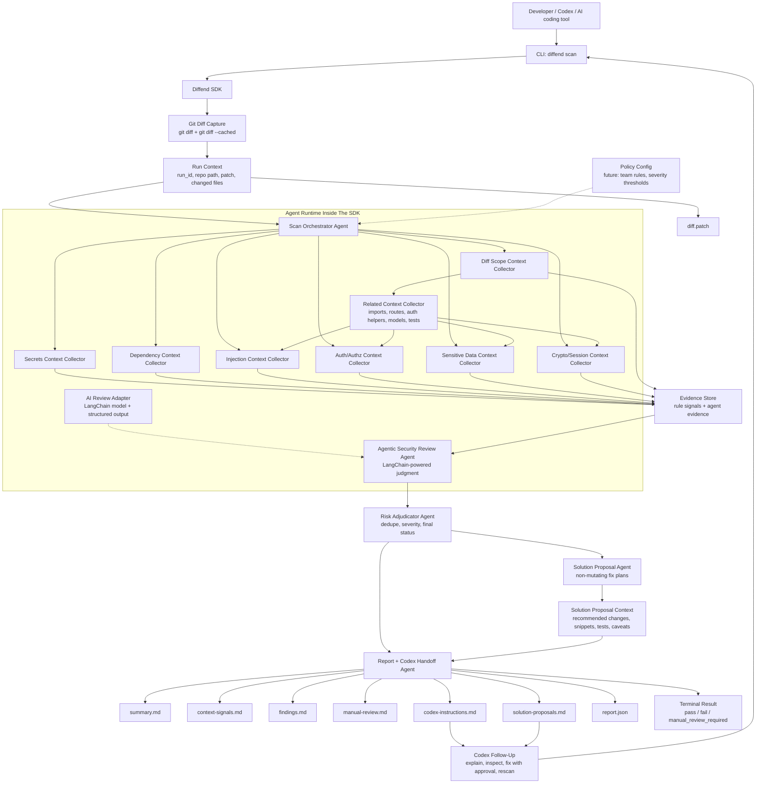
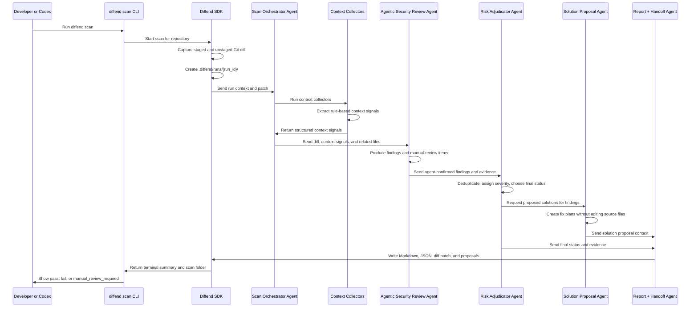

# Diffend

Do not trust AI-generated code blindly. Test every AI-produced diff with `diffend` before shipping.

Diffend means **Diff Defend**: a diff-aware, multi-agent security review system for code changes produced by developers, Codex, or other AI coding tools.

## Idea

AI-assisted coding makes it easy to produce large changes quickly, but security review often becomes the bottleneck. A single diff can include hidden risks that are easy to miss during normal code review, especially when reviewers are also checking functionality, style, and correctness.

Existing automated security tools are useful for common issues like leaked secrets, vulnerable dependencies, injection patterns, and unsafe cryptography. They are weaker at deeper security questions involving authentication, authorisation, privilege boundaries, business logic, session handling, and sensitive data flows.

Diffend is designed to review the code diff first, trace related context only when needed, and produce a persistent scan bundle that can be read by developers, security reviewers, Codex, or another AI coding assistant.

The goal is not just to produce a report. The goal is to create structured security context that an AI agent or human reviewer can use to continue safely.

## Product Shape

Diffend has four connected layers:

- **CLI:** `diffend scan` gives immediate terminal feedback after a code change.
- **SDK:** the reusable scan engine captures diffs, runs security checks, coordinates agents, creates findings, and writes scan bundles.
- **Multi-agent review system:** specialist security agents inspect the diff from different risk perspectives and return structured findings.
- **Context bundle:** generated `.md`, `.patch`, and `.json` files preserve what was scanned, what was found, what needs manual review, proposed solution context, and what Codex or another agent should inspect next.

This means Diffend supports two workflows at the same time:

- quick local security feedback for the developer
- deeper AI-assisted security review through a structured handoff bundle

## Core Principle

Diffend should be:

- **Diff-first:** review changed lines before looking at the whole repository.
- **Evidence-driven:** every finding should point to a file, line, check, and reason.
- **Agent-friendly:** every scan should produce enough context for Codex or another AI agent to continue the task.
- **Signals, not verdicts:** deterministic rules should collect context for agents, not replace agentic security judgment.
- **Human-safe:** uncertain security risks should be escalated to manual review instead of being guessed away.
- **Non-mutating by default:** Diffend may propose fixes, but it should not change application source code without explicit developer approval.
- **Auditable:** every scan should save the exact patch and structured report used to make the decision.

## Multi-Agent Architecture

Diffend uses a supervisor-worker architecture.

The context collectors and agents do not freely chat with each other. Context collectors extract security-relevant signals from the diff. Agentic review nodes use those signals, the patch, and related files to produce structured findings or manual-review items. The orchestrator keeps the flow controlled and auditable.



### Runtime Sequence



### Agent Responsibilities

- **Scan Orchestrator Agent:** owns the run, captures the Git diff, creates `.diffend/runs/<run-id>/`, starts specialist agents, waits for results, and coordinates final output.
- **Diff Scope Context Collector:** identifies changed files, added lines, deleted lines, file types, package files, route files, tests, and areas that may need related context.
- **Rule-Based Context Collectors:** detect security-relevant signals such as secrets, dependency changes, injection patterns, auth/authz changes, sensitive data exposure, and crypto/session risks. These signals are context for agents, not final findings.
- **Agentic Security Review Agent:** uses LangChain structured output, the diff, context signals, and related files to decide which risks become findings or manual-review items.
- **Risk Adjudicator Agent:** merges findings, removes duplicates, assigns severity, decides whether the scan passes, fails, or requires manual review.
- **Solution Proposal Agent:** creates proposed solutions for findings and manual-review items, including suggested file changes, code snippets, test ideas, and caveats. It must not directly modify the codebase.
- **Report + Codex Handoff Agent:** writes human-readable Markdown, machine-readable JSON, the scanned patch, and focused instructions for Codex or another AI coding agent.

### Agentic Review Configuration

The context collectors can run locally without an LLM. To enable the LangChain-backed Agentic Security Review Agent, configure a model through `DIFFEND_LLM_MODEL`.

Example:

```bash
DIFFEND_LLM_MODEL=openai:gpt-4o-mini diffend scan
```

If no model is configured, Diffend still writes `context-signals.md` so the collected signals can be handed to Codex or another agent as review context.

## Workflow

Diffend focuses only on the code diff. It does not try to review the whole repository unless changed lines require related context.

### Execution Flow

1. A developer, Codex, or another AI coding tool makes changes to a repository.
2. The developer runs:

```bash
diffend scan
```

3. The CLI triggers the Diffend SDK.
4. The SDK captures the current Git diff.
5. Diffend creates a scan output folder for the current run.
6. The Scan Orchestrator Agent sends the diff to context collectors.
7. Rule-based context collectors extract security-relevant signals from the diff.
8. The Agentic Security Review Agent uses those signals as context for deeper judgment.
9. The Risk Adjudicator Agent combines agent-confirmed findings into one final decision.
10. The Solution Proposal Agent creates proposed fixes as reviewable context without editing source files.
11. The Report + Codex Handoff Agent writes the final scan bundle.
12. The developer can ask Codex or another agent to read the generated Markdown files for deeper review, explanation, or remediation.

### Git Diff Scope

The first version should scan the current working tree diff:

- unstaged tracked changes from `git diff`
- staged tracked changes from `git diff --cached`

Untracked files should be documented as a limitation in the first version, then added later through explicit file capture.

## Terminal Experience

The terminal output should be short, readable, and useful during normal development.

Example:

```text
Diffend scan started

Checking diff scope context... done
Checking secrets context... done
Checking dependency context... done
Checking injection context... warning
Running agentic security review... manual review required
Creating solution proposals... done

Status: manual review required
Report written to: .diffend/runs/2026-04-29-001/
Next: ask Codex to read .diffend/runs/2026-04-29-001/codex-instructions.md
```

## Final Status Rules

Each scan should end with one final machine-readable status:

- `pass`: no findings and no suspicious areas requiring deeper review
- `fail`: at least one concrete high-confidence security problem was found
- `manual_review_required`: no confirmed failure, but one or more suspicious security-sensitive changes need human or AI-assisted review

The CLI may display `manual_review_required` as `manual review required` for readability. Individual checks may produce lower-level states like `done`, `warning`, or `skipped`, but the final scan status must always be one of the three statuses above.

## Scan Bundle

Each scan should always generate an output folder, even when no problems are found.

Example:

```text
.diffend/
  runs/
    2026-04-29-001/
      summary.md
      context-signals.md
      findings.md
      manual-review.md
      solution-proposals.md
      codex-instructions.md
      diff.patch
      report.json
```

### File Responsibilities

- `summary.md`: human-readable scan summary, final status, checks performed, and next steps.
- `context-signals.md`: rule-based security signals collected as context for the agentic review layer.
- `findings.md`: agent-confirmed findings with severity, evidence, location, agent name, and recommendation.
- `manual-review.md`: suspicious areas that require human or AI-assisted security judgment.
- `solution-proposals.md`: non-mutating proposed fixes, implementation notes, suggested tests, and caveats for developers and Codex.
- `codex-instructions.md`: focused prompt-style handoff file telling Codex what was scanned, what needs deeper review, which files to inspect, and how to continue safely.
- `diff.patch`: the exact Git diff that Diffend scanned.
- `report.json`: structured machine-readable report for future integrations, CI, IDE plugins, dashboards, and AI coding tools.

## Rule Signal Format

Rule-based collectors should return context signals using a shared structure. These are hints for agents, not final findings.

Example:

```json
{
  "signal_id": "signal-001",
  "source": "auth-authz-context",
  "type": "removed_auth_logic",
  "severity_hint": "high",
  "file": "src/routes/admin.ts",
  "line": 42,
  "evidence": "Security-sensitive auth, role, permission, or session logic was removed.",
  "agent_context": "Verify whether the protection was intentionally moved elsewhere before deciding this is a vulnerability.",
  "related_files": [
    "src/middleware/auth.ts"
  ]
}
```

## Finding Format

Agentic review nodes should return findings using a shared structure.

Example:

```json
{
  "finding_id": "finding-001",
  "agent": "auth-authz-risk",
  "type": "authorization_change",
  "severity": "high",
  "status": "manual_review_required",
  "file": "src/routes/admin.ts",
  "line": 42,
  "evidence": "Role check was removed from an admin route.",
  "recommendation": "Verify whether this route still requires admin-only access.",
  "related_files": [
    "src/middleware/auth.ts",
    "src/models/user.ts"
  ]
}
```

## Solution Proposal Format

The Solution Proposal Agent should create proposed fixes as context only. It must not edit source files, stage changes, commit changes, or apply patches.

Each proposal should connect back to one or more findings or manual-review items.

Example:

```json
{
  "proposal_id": "solution-001",
  "source_findings": [
    "finding-001"
  ],
  "title": "Restore admin role enforcement on the admin route",
  "status": "proposed",
  "files_to_review": [
    "src/routes/admin.ts",
    "src/middleware/auth.ts"
  ],
  "recommended_change": "Require an explicit admin role check before the route handler runs.",
  "suggested_code": "router.get('/admin', requireAuth, requireRole('admin'), adminHandler)",
  "tests_to_add": [
    "Non-admin users receive 403 for /admin.",
    "Admin users can still access /admin."
  ],
  "caveats": [
    "Verify whether admin enforcement was intentionally moved to middleware before applying this change."
  ],
  "codex_prompt_context": "Use this proposal as context only. Inspect the related files before editing, then implement the smallest safe fix."
}
```

## Report JSON Shape

The first version of `report.json` should follow a simple schema that can evolve later.

```json
{
  "tool": "diffend",
  "run_id": "2026-04-29-001",
  "status": "manual_review_required",
  "repository": {
    "path": "/path/to/repo",
    "base_ref": null,
    "head_ref": null
  },
  "diff": {
    "files_changed": 3,
    "added_lines": 42,
    "deleted_lines": 8,
    "patch_file": "diff.patch"
  },
  "checks": [
    {
      "agent": "secrets-context",
      "status": "pass",
      "signals_count": 0
    },
    {
      "agent": "agentic-security-review",
      "status": "manual_review_required",
      "manual_review_count": 1
    }
  ],
  "rule_signals": [
    {
      "signal_id": "signal-001",
      "source": "auth-authz-context",
      "type": "removed_auth_logic",
      "severity_hint": "high",
      "file": "src/routes/admin.ts",
      "line": 42
    }
  ],
  "findings": [
    {
      "finding_id": "finding-001",
      "agent": "auth-authz-risk",
      "type": "authorization_change",
      "severity": "high",
      "status": "manual_review_required",
      "file": "src/routes/admin.ts",
      "line": 42
    }
  ],
  "manual_review": [],
  "solution_proposals": [
    {
      "proposal_id": "solution-001",
      "source_findings": [
        "finding-001"
      ],
      "title": "Restore admin role enforcement on the admin route",
      "status": "proposed",
      "files_to_review": [
        "src/routes/admin.ts",
        "src/middleware/auth.ts"
      ],
      "recommended_change": "Require an explicit admin role check before the route handler runs.",
      "tests_to_add": [
        "Non-admin users receive 403 for /admin.",
        "Admin users can still access /admin."
      ]
    }
  ],
  "codex_next_steps": [
    "Read solution-proposals.md before editing.",
    "Inspect src/routes/admin.ts and verify the removed role check.",
    "Check whether src/middleware/auth.ts still protects the route."
  ]
}
```

## Context Handoff Contract

Every scan should leave enough context for a future reviewer or AI coding assistant to answer these questions without starting from scratch:

- What diff was scanned?
- Which files and added lines were involved?
- Which context collectors and agentic review steps ran?
- Which rule-based context signals were collected?
- Which findings are concrete security problems?
- Which areas are suspicious but need deeper judgment?
- Which proposed solutions are available for developer review?
- Which related files should Codex inspect next?
- What is the safest next action for the developer?

## AI Agent Follow-Up Workflow

Diffend should support an AI-assisted review loop after the scan bundle is created.

Example:

1. Developer runs `diffend scan`.
2. Diffend writes `.diffend/runs/<run-id>/context-signals.md`.
3. Diffend writes `.diffend/runs/<run-id>/codex-instructions.md`.
4. Diffend writes `.diffend/runs/<run-id>/solution-proposals.md`.
5. Developer reviews the proposed solution context.
6. Developer asks Codex to read the scan bundle, context signals, and proposals.
7. Codex inspects the exact diff and related files listed by Diffend.
8. Codex explains the security risk.
9. Codex suggests or applies a developer-approved fix.
10. Developer reruns `diffend scan`.
11. Diffend compares the new scan result and produces an updated bundle.
12. The final result is `pass`, `fail`, or `manual_review_required`.

Later versions can support a stronger remediation workflow, but code modification should remain under developer control unless explicit approval is added.

## Implementation Phases

### Phase 1: Deterministic CLI and SDK

Build the first working version of `diffend scan`.

- Implement the CLI command.
- Capture staged and unstaged Git diffs.
- Create `.diffend/runs/<run-id>/` for each scan.
- Write `summary.md`, `context-signals.md`, `findings.md`, `manual-review.md`, `solution-proposals.md`, `codex-instructions.md`, `diff.patch`, and `report.json`.
- Define shared finding and report types.
- Print progress for each check in the terminal.
- Return `pass`, `fail`, or `manual_review_required`.

### Phase 2: Rule-Based Context Collectors

Add deterministic collectors that produce context signals for the agentic review layer.

- Secrets scanning.
- Dependency change detection.
- Simple injection pattern checks.
- Risky authentication or authorisation change detection.
- Sensitive data exposure checks.
- Weak cryptography and unsafe session checks.

### Phase 3: AI-Assisted Risk Review

Add LLM-powered or AI-assisted specialist agents for deeper review.

- Trace related files from the diff when needed.
- Use `context-signals.md` and `rule_signals` as agent context.
- Identify suspicious changes in security-sensitive areas.
- Generate manual review checklists.
- Generate non-mutating solution proposal context for findings.
- Produce higher-quality Codex handoff instructions.
- Keep every conclusion evidence-based.

### Phase 4: Proposal Review and Verification Loop

Add an explicit loop for reviewing proposed solutions and verifying follow-up fixes.

- Improve proposed fix quality with safer implementation plans, code snippets, and test suggestions.
- Keep the Solution Proposal Agent non-mutating.
- Let developers decide whether to hand proposals to Codex or implement them manually.
- Rerun `diffend scan`.
- Compare before and after scan results.
- Produce final review notes.

### Phase 5: Integrations

Extend Diffend beyond local CLI use.

- CI integration.
- GitHub pull request comments.
- IDE plugin support.
- Team dashboards.
- Historical scan comparison.
- Policy configuration for teams.

## Roadmap

### 29/04/2026

- Implement the first version of the `diffend scan` command.
- Implement Git diff capture from the current working tree.
- Define the core Diffend SDK interface:
  - input: repository path and captured diff
  - output: structured security report, final status, and scan output folder
- Create `.diffend/runs/<run-id>/` for each scan.
- Write the first scan bundle files.
- Build the first context collector runner.
- Add initial context collectors for secrets, dependency changes, simple injection patterns, and risky auth/authz changes.
- Define shared finding and report formats.
- Print progress for each check in the terminal.
- Make `codex-instructions.md` useful as a direct handoff prompt for Codex.
- Test the command against small sample diffs.

Goal for the day: `diffend scan` can capture a diff, collect rule-based context signals, print terminal progress, and write a structured scan bundle that developers can hand to Codex for follow-up.

### 30/04/2026

- Implement the first version of the multi-agent review architecture.
- Add the Scan Orchestrator Agent.
- Add specialist agents for secrets, dependencies, injection, auth/authz, sensitive data, and crypto/session review.
- Add the Risk Adjudicator Agent.
- Add the Solution Proposal Agent.
- Add the Report + Codex Handoff Agent.
- Generate a manual review checklist when suspicious security risk is found.
- Generate `solution-proposals.md` with proposed fixes that developers can review before handing them to Codex.
- Merge agent-confirmed findings and security risk findings into one final report.
- Improve `codex-instructions.md` for AI-agent follow-up.
- Run end-to-end tests on sample vulnerable diffs.
- Document known limitations and next steps.

Goal for the day: Diffend can run a multi-agent diff security review and produce a final report with Markdown files that support Codex-assisted follow-up.

## Known Limitations For V1

- Untracked files may not be scanned at first.
- Rule-based context signals will initially rely on simple deterministic patterns.
- Solution proposals are advisory context and must be reviewed before implementation.
- Dependency vulnerability lookups may require later registry or advisory database integration.
- AI-assisted review should be treated as advisory, not as a replacement for human security judgment.
- Diffend should not claim that a scan proves code is secure. It should say what was scanned, what was found, and what still needs review.

## Resources

- [AI-Generated Code Security Risks - Why Vulnerabilities Increase 2.74x and How to Prevent Them](https://www.softwareseni.com/ai-generated-code-security-risks-why-vulnerabilities-increase-2-74x-and-how-to-prevent-them/)

gververvrevervrev
