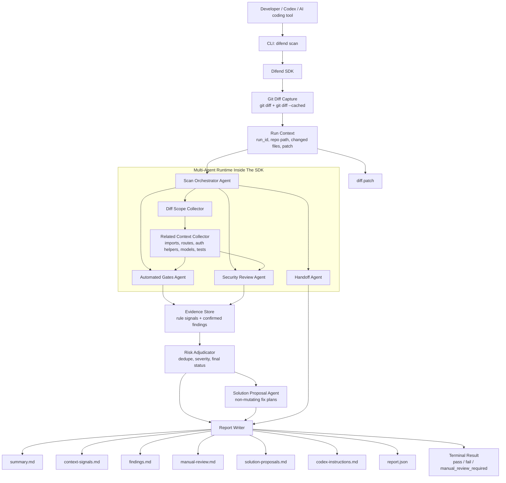
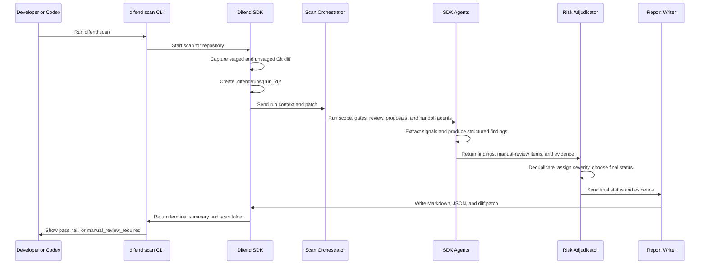

# Difend

Do not trust AI-generated code blindly. Review every AI-produced diff with `difend` before shipping.

Difend means **Diff Defend**: a diff-aware, multi-agent security review SDK with a CLI entry point. It reviews code changes produced by developers, Codex, or other AI coding tools, then writes a persistent scan bundle that humans and AI agents can use for safe follow-up.

## Idea

AI-assisted coding makes it easy to produce large changes quickly, but security review often becomes the bottleneck. A single diff can include hidden risks that are easy to miss during normal code review, especially when reviewers are also checking functionality, style, and correctness.

Existing automated security tools are useful for common issues like leaked secrets, vulnerable dependencies, injection patterns, unsafe shell execution, and weak cryptography. They are weaker at deeper security questions involving authentication, authorisation, privilege boundaries, business logic, session handling, and sensitive data flows.

Difend is designed to review the code diff first, trace related context only when needed, and produce structured security context that can be read by developers, security reviewers, Codex, or another AI coding assistant.

The goal is not only to produce a report. The goal is to create a reusable handoff bundle that explains what changed, what was scanned, what was found, what still needs judgement, and what the safest next action should be.

## Product Shape

Difend has three connected layers:

- **CLI:** `difend scan` gives immediate terminal feedback after a code change.
- **SDK:** the reusable scan engine captures diffs, runs the multi-agent security review system, creates findings, and writes scan bundles.
- **Context bundle:** generated `.md`, `.patch`, and `.json` files preserve what was scanned, what was found, what needs manual review, proposed solution context, and what Codex or another agent should inspect next.

This means Difend supports two workflows at the same time:

- quick local security feedback for developers
- deeper AI-assisted security review through a structured handoff bundle

## Core Principle

Difend should be:

- **Diff-first:** review changed lines before looking at the whole repository.
- **Evidence-driven:** every finding should point to a file, line, check, and reason.
- **SDK-centered:** the CLI should stay thin while the SDK owns capture, orchestration, review, and reporting.
- **Agent-friendly:** every scan should produce enough context for Codex or another AI agent to continue safely.
- **Signals, not blind verdicts:** deterministic rules should collect context for agents, not replace security judgement.
- **Human-safe:** uncertain security risks should be escalated to manual review instead of guessed away.
- **Non-mutating by default:** Difend may propose fixes, but it should not change application source code without explicit developer approval.
- **Auditable:** every scan should save the exact patch and structured report used to make the decision.

## Multi-Agent System Inside The SDK

The Difend SDK owns the multi-agent review system. The CLI calls the SDK, and the SDK coordinates all review work.

The first version should use a supervisor-worker model with a small number of focused agents. Deterministic collectors gather signals from the diff, agentic review nodes make bounded security judgements, and the orchestrator merges everything into one scan result.



### Agent Responsibilities

- **Scan Orchestrator Agent:** owns the scan run, receives the captured diff, starts the other agents, waits for results, and coordinates final output.
- **Diff Scope Collector:** identifies changed files, added lines, deleted lines, file types, package files, route files, tests, and areas that may need related context.
- **Related Context Collector:** traces only the nearby files needed to understand a security-sensitive diff, such as imports, middleware, route definitions, auth helpers, models, or tests.
- **Automated Gates Agent:** checks the diff for concrete security problems such as hardcoded secrets, dangerous dependency changes, injection patterns, unsafe shell execution, weak cryptography, insecure sessions, and sensitive data exposure.
- **Security Review Agent:** looks for suspicious or context-dependent changes involving authentication, authorisation, privilege boundaries, business logic, sessions, personal data, database access, file access, payments, and cryptography.
- **Risk Adjudicator:** merges findings, removes duplicates, assigns severity, and chooses the final status.
- **Solution Proposal Agent:** creates proposed solutions, implementation notes, code snippets, test ideas, and caveats. It must not directly modify source files.
- **Handoff Agent:** writes focused follow-up instructions for Codex or another AI coding agent, including what was scanned, what needs deeper review, which files to inspect, and how to continue safely.
- **Report Writer:** writes human-readable Markdown, machine-readable JSON, and the exact scanned patch.

## Runtime Sequence



## Workflow

Difend focuses on the code diff. It does not try to review the whole repository unless changed lines require related context.

1. A developer, Codex, or another AI coding tool makes changes to a repository.
2. The developer runs:

```bash
difend scan
```

3. The CLI triggers the Difend SDK.
4. The SDK captures the current Git diff.
5. Difend creates a scan output folder for the current run.
6. The Scan Orchestrator Agent sends the diff to the SDK agents.
7. The Automated Gates Agent catches concrete, common security problems.
8. The Security Review Agent flags suspicious context-dependent changes.
9. The Risk Adjudicator combines the results into one final decision.
10. The Solution Proposal Agent creates proposed fixes without editing source files.
11. The Handoff Agent writes Codex follow-up instructions.
12. The Report Writer writes the final scan bundle.
13. The developer can ask Codex or another agent to read the generated Markdown files for deeper review, explanation, or remediation.

## Git Diff Scope

The first version should scan the current working tree diff:

- unstaged tracked changes from `git diff`
- staged tracked changes from `git diff --cached`

Untracked files should be documented as a limitation in the first version, then added later through explicit file capture.

## Terminal Experience

The terminal output should be short, readable, and useful during normal development.

```text
Difend scan started

Checking diff scope... done
Running automated gates... done
Running security review... manual review required
Creating solution proposals... done
Writing Codex handoff... done

Status: manual review required
Report written to: .difend/runs/2026-04-29-001/
Next: ask Codex to read .difend/runs/2026-04-29-001/codex-instructions.md
```

## Final Status Rules

Each scan should end with one final machine-readable status:

- `pass`: no findings and no suspicious areas requiring deeper review
- `fail`: at least one concrete high-confidence security problem was found
- `manual_review_required`: no confirmed failure, but one or more suspicious security-sensitive changes need human or AI-assisted review

The CLI may display `manual_review_required` as `manual review required` for readability. Individual checks may produce lower-level states like `done`, `warning`, or `skipped`, but the final scan status must always be one of the three statuses above.

## Scan Bundle

Each scan should always generate an output folder, even when no problems are found.

```text
.difend/
  runs/
    2026-04-29-001/
      summary.md
      context-signals.md
      findings.md
      manual-review.md
      solution-proposals.md
      codex-instructions.md
      diff.patch
      report.json
```

### File Responsibilities

- `summary.md`: human-readable scan summary, final status, checks performed, and next steps.
- `context-signals.md`: deterministic security signals collected as context for the agentic review layer.
- `findings.md`: confirmed findings with severity, evidence, location, agent name, and recommendation.
- `manual-review.md`: suspicious areas that require human or AI-assisted security judgement.
- `solution-proposals.md`: non-mutating proposed fixes, implementation notes, suggested tests, and caveats for developers and Codex.
- `codex-instructions.md`: focused prompt-style handoff file telling Codex what was scanned, what needs deeper review, which files to inspect, and how to continue safely.
- `diff.patch`: the exact Git diff that Difend scanned.
- `report.json`: structured machine-readable report for future integrations, CI, IDE plugins, dashboards, and AI coding tools.

## Structured Output

Agents should return structured data so the SDK can write both Markdown and JSON reports.

### Context Signal

```json
{
  "signal_id": "signal-001",
  "source": "automated-gates",
  "type": "removed_auth_logic",
  "severity_hint": "high",
  "file": "src/routes/admin.ts",
  "line": 42,
  "evidence": "Security-sensitive auth, role, permission, or session logic was removed.",
  "agent_context": "Verify whether the protection was intentionally moved elsewhere before deciding this is a vulnerability.",
  "related_files": [
    "src/middleware/auth.ts"
  ]
}
```

### Finding

```json
{
  "finding_id": "finding-001",
  "agent": "security-review",
  "type": "authorization_change",
  "severity": "high",
  "status": "manual_review_required",
  "file": "src/routes/admin.ts",
  "line": 42,
  "evidence": "Role check was removed from an admin route.",
  "recommendation": "Verify whether this route still requires admin-only access.",
  "related_files": [
    "src/middleware/auth.ts",
    "src/models/user.ts"
  ]
}
```

### Solution Proposal

```json
{
  "proposal_id": "solution-001",
  "source_findings": [
    "finding-001"
  ],
  "title": "Restore admin role enforcement on the admin route",
  "status": "proposed",
  "files_to_review": [
    "src/routes/admin.ts",
    "src/middleware/auth.ts"
  ],
  "recommended_change": "Require an explicit admin role check before the route handler runs.",
  "suggested_code": "router.get('/admin', requireAuth, requireRole('admin'), adminHandler)",
  "tests_to_add": [
    "Non-admin users receive 403 for /admin.",
    "Admin users can still access /admin."
  ],
  "caveats": [
    "Verify whether admin enforcement was intentionally moved to middleware before applying this change."
  ],
  "codex_prompt_context": "Use this proposal as context only. Inspect the related files before editing, then implement the smallest safe fix."
}
```

## Report JSON Shape

The first version of `report.json` should follow a simple schema that can evolve later.

```json
{
  "tool": "difend",
  "run_id": "2026-04-29-001",
  "status": "manual_review_required",
  "repository": {
    "path": "/path/to/repo",
    "base_ref": null,
    "head_ref": null
  },
  "diff": {
    "files_changed": 3,
    "added_lines": 42,
    "deleted_lines": 8,
    "patch_file": "diff.patch"
  },
  "checks": [
    {
      "agent": "automated-gates",
      "status": "pass",
      "signals_count": 0
    },
    {
      "agent": "security-review",
      "status": "manual_review_required",
      "manual_review_count": 1
    }
  ],
  "context_signals": [
    {
      "signal_id": "signal-001",
      "source": "automated-gates",
      "type": "removed_auth_logic",
      "severity_hint": "high",
      "file": "src/routes/admin.ts",
      "line": 42
    }
  ],
  "findings": [
    {
      "finding_id": "finding-001",
      "agent": "security-review",
      "type": "authorization_change",
      "severity": "high",
      "status": "manual_review_required",
      "file": "src/routes/admin.ts",
      "line": 42
    }
  ],
  "manual_review": [],
  "solution_proposals": [
    {
      "proposal_id": "solution-001",
      "source_findings": [
        "finding-001"
      ],
      "title": "Restore admin role enforcement on the admin route",
      "status": "proposed",
      "files_to_review": [
        "src/routes/admin.ts",
        "src/middleware/auth.ts"
      ],
      "recommended_change": "Require an explicit admin role check before the route handler runs.",
      "tests_to_add": [
        "Non-admin users receive 403 for /admin.",
        "Admin users can still access /admin."
      ]
    }
  ],
  "codex_next_steps": [
    "Read solution-proposals.md before editing.",
    "Inspect src/routes/admin.ts and verify the removed role check.",
    "Check whether src/middleware/auth.ts still protects the route."
  ]
}
```

## Context Handoff Contract

Every scan should leave enough context for a future reviewer or AI coding assistant to answer these questions without starting from scratch:

- What diff was scanned?
- Which files and added lines were involved?
- Which SDK agents ran?
- Which deterministic context signals were collected?
- Which findings are concrete security problems?
- Which areas are suspicious but need deeper judgement?
- Which proposed solutions are available for developer review?
- Which related files should Codex inspect next?
- What is the safest next action for the developer?

## AI Agent Follow-Up Workflow

Difend should support an AI-assisted review loop after the scan bundle is created.

1. Developer runs `difend scan`.
2. Difend writes `.difend/runs/<run-id>/context-signals.md`.
3. Difend writes `.difend/runs/<run-id>/codex-instructions.md`.
4. Difend writes `.difend/runs/<run-id>/solution-proposals.md`.
5. Developer reviews the proposed solution context.
6. Developer asks Codex to read the scan bundle, context signals, and proposals.
7. Codex inspects the exact diff and related files listed by Difend.
8. Codex explains the security risk.
9. Codex suggests or applies a developer-approved fix.
10. Developer reruns `difend scan`.
11. Difend compares the new scan result and produces an updated bundle.
12. The final result is `pass`, `fail`, or `manual_review_required`.

Later versions can support a stronger remediation workflow, but code modification should remain under developer control unless explicit approval is added.

## Implementation Phases

### Phase 1: Deterministic CLI And SDK

Build the first working version of `difend scan`.

- Implement the CLI command.
- Capture staged and unstaged Git diffs.
- Create `.difend/runs/<run-id>/` for each scan.
- Write `summary.md`, `context-signals.md`, `findings.md`, `manual-review.md`, `solution-proposals.md`, `codex-instructions.md`, `diff.patch`, and `report.json`.
- Define shared signal, finding, proposal, and report types.
- Print progress for each check in the terminal.
- Return `pass`, `fail`, or `manual_review_required`.

### Phase 2: SDK Multi-Agent Runtime

Move review work behind a clean SDK orchestration layer.

- Add the Scan Orchestrator Agent.
- Add the Diff Scope Collector.
- Add the Related Context Collector.
- Add the Automated Gates Agent.
- Add the Security Review Agent.
- Add the Risk Adjudicator.
- Add the Solution Proposal Agent.
- Add the Handoff Agent.
- Keep agent inputs and outputs structured.

### Phase 3: Rule-Based Security Collectors

Add deterministic collectors that produce context signals for the agentic review layer.

- Secrets scanning.
- Dependency change detection.
- Injection pattern checks.
- Risky authentication or authorisation change detection.
- Sensitive data exposure checks.
- Weak cryptography and unsafe session checks.
- Unsafe shell, file, and network access checks.

### Phase 4: AI-Assisted Security Review

Add LLM-powered or AI-assisted specialist review inside the SDK.

- Trace related files from the diff when needed.
- Use `context-signals.md` and `context_signals` as review context.
- Identify suspicious changes in security-sensitive areas.
- Generate manual review checklists.
- Generate non-mutating solution proposal context.
- Produce higher-quality Codex handoff instructions.
- Keep every conclusion evidence-based.

### Phase 5: Proposal Review And Verification Loop

Add an explicit loop for reviewing proposed solutions and verifying follow-up fixes.

- Improve proposed fix quality with safer implementation plans, code snippets, and test suggestions.
- Keep the Solution Proposal Agent non-mutating.
- Let developers decide whether to hand proposals to Codex or implement them manually.
- Rerun `difend scan`.
- Compare before and after scan results.
- Produce final review notes.

### Phase 6: Integrations

Extend Difend beyond local CLI use.

- CI integration.
- GitHub pull request comments.
- IDE plugin support.
- Team dashboards.
- Historical scan comparison.
- Policy configuration for teams.

## Known Limitations For V1

- Untracked files may not be scanned at first.
- Rule-based context signals will initially rely on simple deterministic patterns.
- Solution proposals are advisory context and must be reviewed before implementation.
- Dependency vulnerability lookups may require later registry or advisory database integration.
- AI-assisted review should be treated as advisory, not as a replacement for human security judgement.
- Difend should not claim that a scan proves code is secure. It should say what was scanned, what was found, and what still needs review.

## Resources

- [AI-Generated Code Security Risks - Why Vulnerabilities Increase 2.74x and How to Prevent Them](https://www.softwareseni.com/ai-generated-code-security-risks-why-vulnerabilities-increase-2-74x-and-how-to-prevent-them/)
